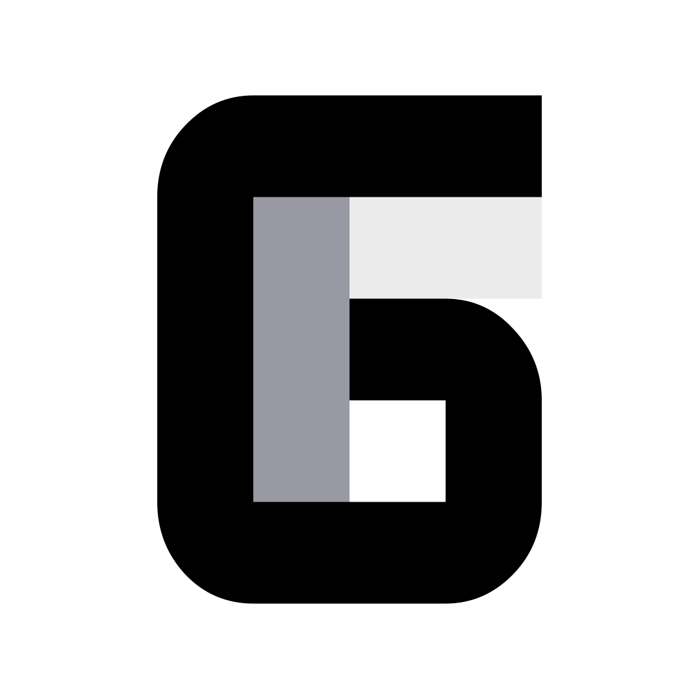

# geee

Geee is a very bare bone library to build games. 
It´s a mix between a game engine and framework (e. g Monogame).
Scripting is done through the runtime where you can load the scenes, assets created in the editor.
It currently uses exclusivly Vulkan as the graphics API. 


### Current Features

- 2D quad, bezier splines Rendering
- Basic 3D redering 
- ImGui as Editor UI

### Current Goals

- Basic scene/level editor
- Asset Management, asset browser
- Basic renderer/application multithreading
- Physically based rendering

## Getting Started

### Prerequisites

- **Vulkan SDK:** with Shader Toolchain Debug Symbols.

### Setup

1. **Clone the Repository:** 
    ```bash
    git clone --recursive https://github.com/Anton-Horn/geee.git
    ```
    ```bash
    cd geee
    ```
    ```bash
    build.bat
    ```

2. **Building the Application:**
   - For Visual Studio: run build.bat
   - Any other build systems: run premake with desired target

## Usage

### Create scenes

1. compile and run the editor project

### Building own runtime, scripting

1. Setup
   -Link enginecore and set src as include path

```cpp
#include "ec.h"

void createApp(ec::Application& app) {

}

void updateApp() {

}

void terminateApp() {

}

// ...

ec::ApplicationCreateInfo createInfo;
createInfo.createCallback = createApp;
createInfo.updateCallback = updateApp;
createInfo.terminateCallback = terminateApp;
createInfo.windowCreateInfo = { 1280, 720, "window_name" };

ec::Application app;
app.create(createInfo);
```

### Native C++ Scripting

- All main components of the engine can be accessed through C++ 

## Used Libraries

1. Core

- cgltf: loading gltf models
- glfw: platform independent window creation and user input
- glm: math library
- spdlog: fast threadsafe logging library
- vma: used to allocate vulkan memory

2. Editor

- imgui

## Contributing

Contributions are welcome! If you'd like to contribute, please follow these steps:

1. Fork the repository.
2. Create a new branch for your feature or bug fix.
3. Commit your changes.
4. Push your changes to your fork.
5. Submit a pull request.

## License

This project is licensed under the MIT License
